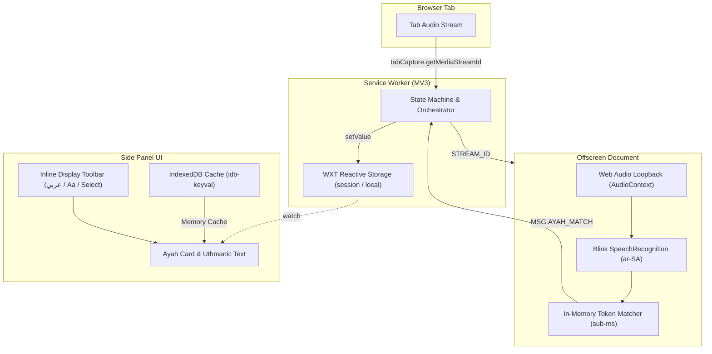

# Quran Transcriber

A Chrome extension (Manifest V3) that listens to Quran recitation playing in any browser tab, performs real-time speech recognition, and displays synchronized verses alongside multilingual translations in a side panel.

---

## Features

- **Real-Time Recitation Tracking**: Captures tab audio via `browser.tabCapture` and synchronizes matching verses with sub-millisecond in-memory search.
- **Audible Loopback**: Tab audio remains audible via the Web Audio API without latency or feedback.
- **Multilingual Translations**: Curated editions across 8 languages, displayed in their native scripts:
  - `العربية` (Original Quranic text)
  - `English` (Saheeh International)
  - `Français` (Muhammad Hamidullah)
  - `اردو` (Fateh Muhammad Jalandhry, RTL)
  - `Bahasa Indonesia` (Kemenag)
  - `Türkçe` (Diyanet İşleri)
  - `Deutsch` (Bubenheim & Elyas)
  - `Español` (Julio Cortes)
  - `Русский` (Elmir Kuliev)
- **Phonetic Transliteration**: Latin and Cyrillic phonetic transliteration support (English, Turkish, Russian) with automatic language pairing for non-Arabic readers.
- **BiDi-Safe End-of-Verse Numbering**: Inline ayah numbering pills mirroring traditional Quranic verse markers (`۝`), with script-aware numerals and BiDi isolation (`<bdi>`).
- **Flexible Display Controls**: Inline toolbar to toggle Arabic (`[عربي]`), transliteration (`[Aa]`), or choose translations from a native dropdown with blank-card safety.
- **Offline-First Storage**: Download translations once (~1.2 MB per pack) for offline use. Verse retrieval requires zero network calls.
- **Authentic Mushaf Typography**: Bundled Uthmanic font with OpenType ligatures, ayah markers (`۝`), and Sajdah badges (`۩`).

---

## Privacy & Local Processing

> **100% Local Verse Retrieval - No Tracking, No Audio Logging**

- **Zero Audio Retention**: The extension never records, stores, or uploads audio files. Audio streams exist only in temporary memory during an active listening session.
- **Zero Extension Servers**: The extension runs entirely client-side with no analytics, telemetry, or third-party servers.
- **Local Verse Matching**: Search and verse retrieval run 100% locally in-memory against the bundled Quran text.
- **Browser-Native Speech**: Speech-to-text uses the browser's built-in speech recognition engine.
- **External Requests**: Limited exclusively to downloading translation text files from `api.alquran.cloud` upon explicit user request.

---

## Architecture



For technical specifications, see [docs/ARCHITECTURE.md](docs/ARCHITECTURE.md). For agent directives and developer invariants, see [AGENTS.md](AGENTS.md).

---

## Tech Stack

- **Framework**: [WXT](https://wxt.dev/) (Manifest V3, Vite-based)
- **Language**: TypeScript (Strict mode)
- **Audio & Speech**: Chromium Blink Speech Recognition + Web Audio API
- **Storage**: IndexedDB via `idb-keyval` (translations) + `wxt/storage` (session & local preferences)
- **Linter & Formatter**: [Biome](https://biomejs.dev/)
- **Test Runner**: [Vitest](https://vitest.dev/) with `fake-indexeddb`

---

## Development

### Prerequisites
- Node.js 20+
- `pnpm` (strictly required; do not use `npm` or `node` directly)

### Commands
```bash
# Install dependencies
pnpm install

# Run test suite
pnpm test

# Typecheck TypeScript
pnpm exec tsc --noEmit

# Lint and format check
pnpm exec biome check

# Start development mode
pnpm dev

# Build production extension
pnpm run build
```

---

## Acknowledgments & Data Sources

- **[Tanzil Project](https://tanzil.net/)**: Verified Arabic Quran text corpus and Surah/Ayah metadata.
- **[Al-Quran Cloud](https://alquran.cloud/) / [Islamic Network](https://islamic.network/)**: Multilingual translation and transliteration edition data.
- **[King Fahd Glorious Quran Printing Complex (KFGQPC)](https://qurancomplex.gov.sa/)**: Authentic digital Uthmanic font (`UthmanTN`).

---

## License

This project is licensed under the [MIT License](LICENSE).
