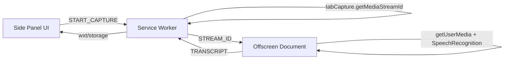

# Architecture

## Data Flow



## Component Responsibilities

### Service Worker (`entrypoints/background/`)

The central orchestrator. Runs as an ephemeral MV3 service worker.

- Opens the side panel on extension icon click
- Manages the offscreen document lifecycle (create/destroy)
- Obtains tab audio stream IDs via `browser.tabCapture.getMediaStreamId()`
- Routes messages between the side panel and offscreen document
- Maintains capture state in `wxt/storage` (survives SW restarts)

**State machine:** `idle → starting → capturing → stopping → idle`

All state lives in `wxt/storage` (using the `session:` prefix) — never in module-level variables.

### Side Panel (`entrypoints/sidepanel/`)

The persistent user-facing UI. Stays open across tab switches.

- Start/Stop button sends messages to the service worker
- Reactively updates via WXT's `storage.defineItem().watch()` (no polling)
- Displays Arabic transcript in an RTL text area
- All strings localized via `browser.i18n.getMessage()`

### Offscreen Document (`entrypoints/offscreen/`)

The audio processing bridge. Runs in a hidden document context.

- Receives stream ID from the service worker
- Calls `getUserMedia()` with `chromeMediaSource: 'tab'` to obtain the audio stream
- Routes audio through an `<audio>` element so the user still hears tab audio
- Feeds the stream into `SpeechRecognition` (lang: `ar`, continuous, interim results)
- Handles resilient reconnection when SpeechRecognition drops (silence/timeout)
- Forwards transcript text back to the service worker

Only uses `browser.runtime` messaging — no other extension APIs.

### Shared Library (`lib/`)

- `messages.ts` — Typed message constants for inter-context communication
- `state.ts` — Typed reactive storage items via `wxt/storage`

## Communication Pattern

All inter-context communication uses `browser.runtime.sendMessage` with typed message objects:

```
Side Panel → Service Worker: START_CAPTURE, STOP_CAPTURE
Service Worker → Offscreen:  STREAM_ID, STOP_CAPTURE
Offscreen → Service Worker:  TRANSCRIPT, ERROR
Service Worker → Side Panel:  (via wxt/storage reactivity)
```

The side panel receives updates reactively through `wxt/storage` watchers, avoiding the need for direct message passing from the service worker back to the UI.

## Constraints

- **Chromium-only** — `browser.tabCapture` and `browser.offscreen` have no Firefox equivalents
- **Single offscreen document** — Chrome allows only one per extension
- **SW ephemeral** — Service worker terminates after ~30s of inactivity; all state persisted in storage
- **SpeechRecognition drops** — Chrome's built-in recognition times out on silence; auto-reconnect handles this
