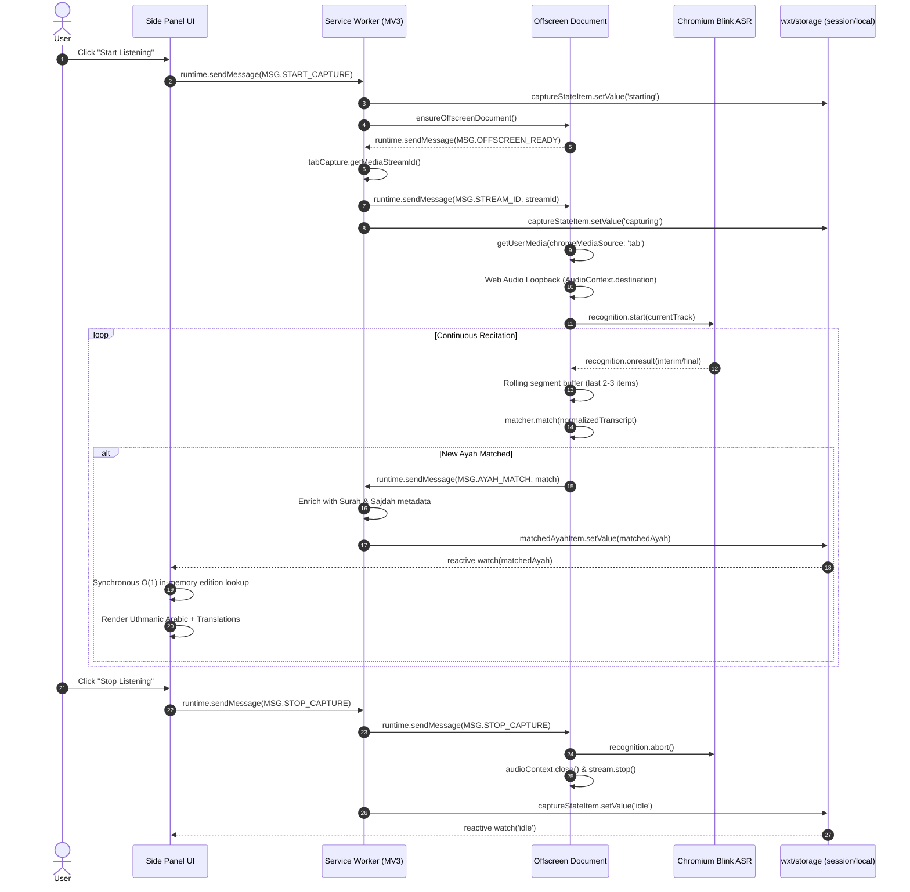

# Architecture & Technical Specifications

Technical reference for the Quran Transcriber extension architecture, subsystem boundaries, data lifecycle, and communication protocols.

---

## 1. End-to-End Sequence & Data Flow



---

## 2. Subsystem Responsibilities

### 2.1 Background Service Worker (`entrypoints/background/index.ts`)
The orchestrator running in an ephemeral Manifest V3 service worker lifecycle:
- **Side Panel Activation**: Listens to `browser.action.onClicked` and opens the side panel via `browser.sidePanel.open({ windowId })`.
- **Capture State Machine**:
  ```text
  IDLE ──(START_CAPTURE)──> STARTING ──(STREAM_ID received)──> CAPTURING
    ▲                                                              │
    └──────────────────(STOP_CAPTURE / Error)─────────────────────┘
  ```
  State is persisted in `wxt/storage` under the `session:` prefix to survive service worker idle termination.
- **Offscreen Lifecycle Management**: Spawns the offscreen document with `reasons: ['USER_MEDIA']`, waits for `MSG.OFFSCREEN_READY` (5-second timeout), and handles clean teardown.
- **Metadata Enrichment**: Enriches raw verse matches (`surah`, `ayah`, `index`) with canonical Quranic metadata from `lib/quran-meta.ts` (Arabic/English names, Sajdah prostration flag, Uthmanic ayah marker glyphs).

### 2.2 Offscreen Audio & ASR Bridge (`entrypoints/offscreen/main.ts`)
Executes isolated audio processing in a dedicated document context:
- **Tab Capture Ingestion**: Calls `navigator.mediaDevices.getUserMedia` with `chromeMediaSource: 'tab'` using the `streamId` provided by the service worker.
- **Web Audio Loopback**: Forwards audio to `AudioContext.destination` via `createMediaStreamSource(mediaStream)`. Ensures the tab remains audible to the user without perceptible delay or feedback loops. Automatically handles `audioContext.resume()` if suspended.
- **Blink SpeechRecognition Track Routing**: Directly injects the tab's `MediaStreamTrack` into `recognition.start(currentTrack)`. This is a Chromium Blink internal API (`speech_recognition.cc:L140`) allowing speech recognition on tab streams rather than the microphone.
- **Resilient Auto-Reconnection**: Chromium's built-in recognition automatically times out during pauses or silence (`onend`). The bridge implements exponential backoff reconnection (`Math.min(1000 * 2^attempt, 16000)`) with a sliding retry window.
- **In-Memory Matching**: Executes the verse matching algorithm synchronously inside the `onresult` callback using a sliding context buffer of the latest 2-3 speech segments.

### 2.3 Verse Matcher Engine (`lib/matcher.ts` & `lib/normalize.ts`)
A zero-dependency, ultra-low latency in-memory Arabic search engine:
- **Corpus Loading**: Loaded once at offscreen initialization into an in-memory tokenized array of 6,236 Ayahs (`public/data/quran.json`).
- **Arabic Text Normalization (`lib/normalize.ts`)**:
  - Strips all Arabic tashkeel (fathah, dammah, kasrah, sukun, shaddah, tanween).
  - Normalizes alef variants (`أ`, `إ`, `آ`, `ٱ` → `ا`).
  - Normalizes taa marbuta (`ة` → `ه`) and alef maqsura (`ى` → `ي`).
  - Removes tatweel / kashida (`ـ`) and collapses duplicate whitespace.
- **Matching Algorithm**: Tokenizes the normalized transcript into consecutive n-gram windows and performs sliding token scan against the corpus. Sub-millisecond match times (<0.1ms) across the entire Quran prevent audio renderer thread blocking.

### 2.4 Multilingual Data Layer (`lib/editions.ts`)
Offline-first translation and transliteration management:
- **Curated Edition Catalog**: Fixed metadata for 8 translation editions (Saheeh International, Hamidullah, Jalandhry, Indonesian Ministry, Diyanet, Bubenheim, Cortes, Kuliev) and 1 English phonetic transliteration.
- **Strict Payload Validation**: `validateAndFlattenEdition()` verifies API payloads from `https://api.alquran.cloud/v1/quran/...`:
  - Enforces HTTP 200 / `code === 200`.
  - Verifies exact count of 114 Surahs.
  - Verifies Surah-by-Surah ayah counts against canonical Quran metadata.
  - Flattens into a contiguous `string[]` of exactly 6,236 Ayahs (~1.2 MB per edition).
- **IndexedDB Caching**: Persisted locally via `idb-keyval` using the `edition:<identifier>` key schema.
- **Zero-Network UI Hydration**: `loadActiveEditions()` queries only IndexedDB. UI initialization never makes blocking network calls.

### 2.5 Side Panel UI (`entrypoints/sidepanel/`)
The persistent user-facing reading interface:
- **Reactive Watchers**: Uses `wxt/storage` reactive listeners (`watch()`) for state and matched verses. Never polls.
- **Render Memoization**: `renderedAyahKey` computes a composite hash (`surah:ayah:index:showAr:showTranslit:translitId:transId`) to prevent redundant DOM manipulation when identical matches are re-emitted.
- **Synchronous Translation Access**: Reads active translations from an in-memory `Map<string, StoredEdition>` populated on preference changes. Active recitation rendering is 100% synchronous O(1) array access.
- **Inline Display Toolbar**:
  - `[عربي]` toggle: Toggles Arabic Quranic text on/off.
  - `[Aa]` toggle: Toggles English phonetic transliteration on/off.
  - Native select: Populated with native endonyms (`العربية`, `English`, `Français`, `اردو`, etc.) and a `+ Download Languages...` action trigger.
- **Blank-Card Safeguard**: Ensures the UI never displays an empty card. Disabling Arabic is blocked if no translation or transliteration is active. Removing active translations while Arabic is hidden auto-restores Arabic.
- **Settings Modal**: Serves as a dedicated offline download manager displaying pack sizes (~1.2 MB), download progress, and cache removal (`Remove` button) to reclaim disk space.

---

## 3. Typographic & BiDi Architecture

- **W3C BiDi Isolation (`<bdi>`)**: In mixed-script contexts, dynamic labels and badges are isolated using `<bdi>` elements to prevent Unicode Bidirectional Algorithm (UBA) bleeding.
- **Neutral Character Transposition Prevention**: Compound numeric strings containing neutral delimiters (such as `ayahBadgeEl` showing `2:255 (1/7)`) are wrapped with `<bdi dir="ltr">` to prevent colon/parenthesis reversal when rendered within RTL parent document contexts.
- **CSS Logical Properties**: Layout directions use logical properties (`text-align: start`, `margin-inline-start`, `padding-inline-end`, `inset-inline-start`) rather than physical directional constraints.
- **Font Stack**: Bundled local font asset `/fonts/UthmanTN_v2-0.ttf` loaded via `@font-face` `"Uthmanic"`, styled with `text-rendering: optimizeLegibility` and OpenType ligature features (`liga 1`, `calt 1`).

---

## 4. Security & Permissions Reference

| Permission | Justification |
|---|---|
| `tabCapture` | Capture audio from the user's active browser tab for recitation analysis. |
| `offscreen` | Execute Web Audio loopback and Chromium speech recognition in an isolated background environment. |
| `sidePanel` | Display synchronized Quran verses and translations alongside the active webpage. |
| `storage` | Persist active session state and user language preferences across browser restarts. |
| `host_permissions` | Restricted strictly to `https://api.alquran.cloud/*` to fetch user-requested translation packs. |
